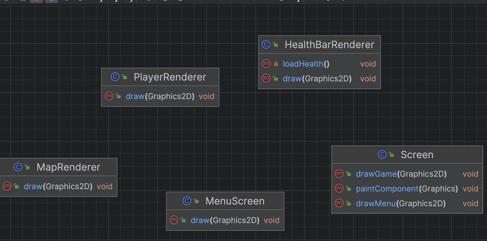

# Models

## **Entity**

#### **Attributes:**

* **`x`**: The x-coordinate of the entity.
* **`y`**: The y-coordinate of the entity.
* **`speedX`**: The speed of the entity in the x-direction.
* **`speedY`**: The speed of the entity in the y-direction.
* **`jumpingDistance`**: The jumping distance of the entity.
* **`health`**: The current health of the entity.
* **`maxHealth`**: The maximum health of the entity.
* **`damage`**: The damage value of the entity.
* **`width`**: The width of the entity's picture.
* **`height`**: The height of the entity.
* **`image`**: The current image of the entity.
* **`animationPresent`**: An array of node images representing the animation frames.
* **`realWidth`**: The real width of the entity.
* **`isKilled`**: A boolean indicating whether the entity is killed or not.
* **`logger`**: An instance of the logger for logging messages.

**methods:**

* **`moveRight()`**: Moves the entity to the right.
* **`moveLeft()`**: Moves the entity to the left.

_– also getters and setters_

{height="400px"}

## **Player**

**_extends Entity_**

#### **Attributes:**

* **`runAnimation`**: An array of node images representing the running animation for the player.
* **`chargeAnimation`**: An array of node images representing the charging animation for the player.
* **`damageAnimation`**: An array of node images representing the damage animation for the player.
* **`attackAnimation`**: An array of node images representing the attack animation for the player.
* **`deathAnimation`**: An array of node images representing the death animation for the player.
* **`animationType`**: The current animation type of the player.
* **`attackDistance`**: The attack distance of the player.

#### **Methods:**

– also getters and setters

_The **Player** class extends the **Entity** class, inheriting its attributes and methods._

**Monster**

#### **Attributes:**

* **`initialX`**: The initial x-coordinate of the monster.
* **`distanceRange`**: The distance range of moving from side to side for the monster.
* **`animationType`**: The current animation type of the monster.

#### **Methods:**

_– also getters and setters_

_The **Monster** class extends the **Entity** class, inheriting its attributes and methods._

**_!has instances, wich are just types of monster!_**

{height="200px"}

## Potion

#### **Attributes:**

* **`x`**: The x-coordinate of the potion.
* **`y`**: The y-coordinate of the potion.
* **`imgSrc`**: The image source of the potion.
* **`type`**: The type of the potion.
* **`visible`**: Indicates whether the potion is visible or not.

#### **Methods:**

– also getters and setters

**_!has instances, wich are just types of potion!_**

{height="200px"}

## **Map**

Represents the map in the game.

#### **Attributes:**

* **`monsters`**: An array of **`Monster`** objects in the map.
* **`mapMatrix`**: A two-dimensional array of **`Tile`** objects representing the map.
* **`maxScreenColumn`**: The maximum number of columns visible on the screen.
* **`maxScreenRow`**: The maximum number of rows visible on the screen.
* **`totalScreenColumn`**: The total number of columns in the map.
* **`totalScreenRow`**: The total number of rows in the map.
* **`potions`**: An array of **`Potion`** objects in the map.
* **`portal`**: The **`Portal`** object in the map.
* **`backgroundSrc`**: The image source of the background.
* **`levelSrc`**: The file path of the level source.
* **`offsetX`**: The x-offset of the map _now_.
* **`offsetY`**: The y-offset of the map _now_.
* **`maxOffsetX`**: The maximum x-offset of the map.
* **`maxOffsetY`**: The maximum y-offset of the map.

#### **Methods:**

* **`getPotion(int x, int y)`**: Retrieves the potion at the specified coordinates.
* **`getMonster(int x, int y)`**: Retrieves the monster at the specified coordinates.
* **`getMonsterOnRange(int range, int initialPointX, int initialPointY)`**: Retrieves the monsters within a certain range of coordinates.
* **`loadMap(String src)`**: Loads the map from the specified source.
* **`getTile(int x, int y)`**: Retrieves the tile at the specified coordinates.

_– also getters and setters_

{height="400px"}

## **Levels**

#### **Attributes**

* **`currentLevelNumber`**: An integer representing the current level number.
* **`levels`**: An array of **`Level`** objects representing the levels in the game.
* **`currentLevel`**: A **`Map`** object representing the current level map.

#### **Methods**

* **`getCurrentLevelNumber()`**: A method that returns the current level number.
* **`setToNextLevel()`**: A method that sets the current level to the next level.

– also getters and setters

### **Level**

#### Attributes

* **`totalScreenColumn`**: An integer representing the total number of screen columns.
* **`totalScreenRow`**: An integer representing the total number of screen rows.
* **`potions`**: An array of **`Potion`** objects representing the potions in the level.
* **`map`**: A **`Map`** object representing the map of the level.
* **`monsters`**: An array of **`Monster`** objects representing the monsters in the level.
* **`portal`**: A **`Portal`** object representing the portal in the level.
* **`background`**: A string representing the background image for the level.
* **`levelSrc`**: A string representing the level source.

#### Methods

_getters and setters_

{height="400px"}

## Tile

**Attributes**

* **`imgSrc`**: A string representing the image source of the tile.
* **`collision`**: A boolean indicating if the tile is a collision tile.
* **`damaging`**: A double representing the amount of damage the tile inflicts.
* **`x`**: An integer representing the x-coordinate of the tile.
* **`y`**: An integer representing the y-coordinate of the tile.

#### **Methods**

_getters and setters_

{height="200px"}

## **Portal**

#### **Attributes**

* **`x`**: An integer representing the x-coordinate of the portal.
* **`y`**: An integer representing the y-coordinate of the portal.
* **`animation`**: An array of **`Animation.NodeImage`** objects representing the animation frames for the portal.
* **`image`**: A **`Animation.NodeImage`** object representing the current image frame of the portal.
* **`isComplete`**: A boolean indicating whether the portal is complete.

#### **Methods**

* **`setY(int y)`**: Sets the y-coordinate of the portal.
* **`isComplete()`**: Checks if the portal is complete.

{height="200px"}

## **Menu**

#### **Attributes**

* **`options`**: An array of strings representing the available options in the menu.
* **`selectedOption`**: An integer representing the index of the currently selected option.

#### **Methods**

* **`getSelectedOption()`**: Returns the currently selected option.
* **`setSelectedOption(int increase)`**: Sets the selected option by increasing or decreasing the current selection. If the **`increase`** value is negative, it will decrease the selection. If the **`increase`** value is positive, it will increase the selection.
* **`getOptions()`**: Returns the array of available options in the menu.

## **GameState**

### **Attributes**

* **`player`**: The player in the game.
* **`levels`**: The levels in the game.
* **`menu`**: The menu in the game.
* **`gameController`**: The game controller.
* **`menuController`**: The menu controller.
* **`currentController`**: The current active controller.
* **`keyH`**: The key handler.
* **`logger`**: The logger instance.
* **`currentState`**: The current state of the game.
* **`fileStoragePlayer`**: The file path for storing player information.
* **`fileStorageMonsters`**: The file path for storing monster information.
* **`fileStoragePotions`**: The file path for storing potion information.
* **`fileStorageLevel`**: The file path for storing level information.

### **Methods**

* **`saveChanges()`**: Saves the changes in the game to storage.
* **`loadChanges()`**: Loads the saved changes from storage.

– also getters and setters

### **Nested Classes (for serialising)**

#### EntityInfo

The **`EntityInfo`** class represents the information about an entity. It holds the x and y coordinates, health, and killed state.

* **`EntityInfo(Entity entity)`**: Constructs a new **`EntityInfo`** object based on the given entity.
* **`setEntityInfo(Entity entity)`**: Sets the entity information based on the given entity.

#### LevelInfo

* **`LevelInfo(Levels levels)`**: Constructs a new **`LevelInfo`** object based on the given levels.

{height="200px"}

# Controller

{height="450px"}

## **GameController**

The **`GameController`** class is responsible for controlling the game logic and interactions between entities. It extends the **`Controller`** class.

#### Attributes:

* **`timerPlayer`**: An instance of the **`Timer`** class for scheduling player-related tasks.
* **`timerMonster`**: An instance of the **`Timer`** class for scheduling monster-related tasks.
* **`player`**: The player entity.
* **`keyH`**: The KeyHandler for user input.
* **`levels`**: The Levels object containing the game levels.
* **`map`**: The current map level.
* **`monsters`**: An array of Monster entities present in the current level.
* **`gameState`**: The current game state.
* **`logger`**: An instance of the Logger class for logging messages.
* **`jumping`**: A boolean indicating whether the player is currently jumping.
* **`attacking`**: A boolean indicating whether the player is currently attacking.
* **`deathing`**: A boolean indicating whether the player is currently in the process of dying.
* **`leanBack`**: A boolean indicating whether the player is currently leaning back.
* **`jumpingHeight`**: The height at which the player starts a jump.
* **`isCollisionTop`**: A boolean indicating whether there is a collision on the top side of the player.
* **`isCollisionBottom`**: A boolean indicating whether there is a collision on the bottom side of the player.
* **`isCollisionMove`**: A boolean indicating whether there is a collision in the direction the player is moving.
* **`isCollisionBack`**: A boolean indicating whether there is a collision when the player leans back.

#### Methods:

* **`GameController(player: Player, keyH: KeyHandler, gameState: GameState)`**: Initializes the game controller with the necessary entities and objects.
* **`updateCollision()`**: Updates the collision status based on the player's position and the surrounding tiles.
* **`initPortalAnimation()`**: Initializes the portal animation.
* **`takePotion(potion: Potion)`**: Handles the action of taking a potion and updates the player's attributes accordingly.
* **`updatePotion()`**: Handles the collision between player and potion.
* **`takeDamage(damage: double)`**: Updates the player's health and state based on the damage received from a damaging tile/monster.
* **`updateMonsterCollision()`**: Handles the collision between monster and player.
* **`leanBack()`**: Leans the player back with special logic.
* **`updateAttacking()`**: Handles the attack action from the user.
* **`attack()`**: Implements the attack logic between the player and monsters.
* **`updateLevelState()`**: Handles the position of the player to the portal (end of level) and performs logic for completing levels or the game.
* **`initPlayerAnimation()`**: Initializes the player's animation.
* **`initMonsterMoving()`**: Initializes the monster animation and movement from side to side.
* **`update()`**: Calls all update handlers.
* **`moving()`**: Handles the user's action to move.
* **`moveNext()`**: Releases the logic of the player's moving and applies the "map camera" effect.
* **`moveDown()`**: Implements logic for the player's falling.

– also getters and setters

## **MenuController**

The **`MenuController`** class is responsible for handling user input and changing the game state. It extends the **`Controller`** class.

### **Attributes**

* **`KeyHandler keyH`**: The **`KeyHandler`** object for handling user input.
* **`Menu menu`**: The **`Menu`** object for displaying the menu options (model).
* **`GameState gameState`**: The **`GameState`** object for managing the game state.
* **`Timer timer`**: A timer object for scheduling tasks.
* **`boolean setting`**: A boolean flag indicating if menu changes are allowed.
* **`Logger logger`**: A logger object for logging information.

### **Methods**

* **`setNextChoice()`**: Sets the next menu choice based on the user input. Handles the actions to be performed when a menu option is selected.
* **`unSetting()`**: Sets the **`setting`** variable to **`true`** for a brief period to prevent rapid menu changes.
* **`update()`**: Handles the player's choice. It checks if the **`setting`** is **`false`** and calls the **`setNextChoice()`** and **`unSetting()`** methods.

# Views

{height="200px"}

## **PlayerRenderer**

The **`PlayerRenderer`** class is responsible for rendering the player entity on the screen.

#### **Attributes**

* **`Player player`**: The player entity to be rendered.

#### **Methods**

* **`draw`**: Draws the player on the screen.

## **HealthBarRenderer Class**

The **`HealthBarRenderer`** class is responsible for rendering the health bar for an entity on the screen.

### **Attributes**

* **`entity`**: The entity for which the health bar is being rendered.
* **`x`**: The x-coordinate of the health bar's position.
* **`y`**: The y-coordinate of the health bar's position.
* **`size`**: The size of each health bar segment.
* **`healthCount`**: The total number of health bar segments.
* **`healthArray`**: An array of BufferedImages representing the different health bar segments.

### **Methods**

* **`loadHealth()`**: Loads the health bar images from the resource file.
* **`draw`**: Draws the health bar on the screen.

## **MapRenderer Class**

The **`MapRenderer`** class is responsible for rendering the game map, including the background, tiles, potions, monsters, and portal.

#### **Attributes**

* **`map`**: The map object to be rendered.
* **`backgroundSrc`**: The source file path of the background image.
* **`potions`**: An array of potions present on the map.
* **`monsters`**: An array of monsters present on the map.
* **`portal`**: The portal object on the map.

### **Methods**

* **`draw`**: Renders the map on the screen. It loads and renders the background image, tiles, potions, monsters, and the portal

## **Screen**

#### **Attributes**

* **`int tileSize`**: The size of each tile in pixels.
* **`int maxScreenColumn`**: The maximum number of columns on the screen.
* **`int maxScreenRow`**: The maximum number of rows on the screen.
* **`int screenWidth`**: The width of the screen in pixels.
* **`int screenHeight`**: The height of the screen in pixels.
* **`PlayerRenderer playerRenderer`**: The player renderer object for drawing the player.
* **`MapRenderer mapRenderer`**: The map renderer object for drawing the game map.
* **`HealthBarRenderer playerHealth`**: The player health bar renderer object for drawing the player's health bar.
* **`MenuScreen menuScreen`**: The menu screen object for drawing the menu.
* **`GameState gameState`**: The game state containing the current game information.

#### **Methods**

* **`drawGame(Graphics2D g2)`**: Draws the game elements on the screen using the specified **`Graphics2D`** object. It initializes the player renderer, health bar renderer, and map renderer objects and calls their respective **`draw`** methods.
* **`drawMenu(Graphics2D g2)`**: Draws the menu screen on the screen using the specified **`Graphics2D`** object. It calls the **`draw`** method of the menu screen object.
* **`paintComponent(Graphics g)`**: Overrides the **`paintComponent`** method to handle the rendering of the screen. It checks the current game state and calls the appropriate draw methods to render the game elements or display the game over or game finished messages.

\-- contains all renderers like a root of view

# All classes diagram

