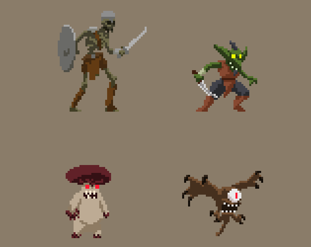
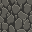
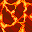
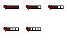
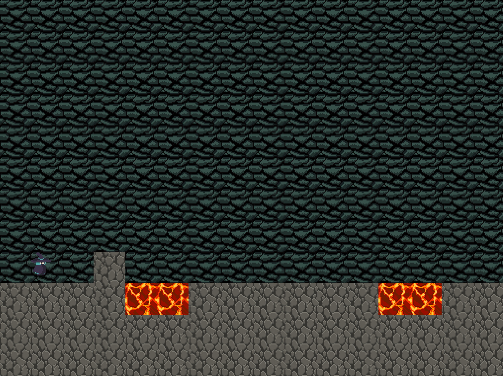

# **Witching Hour Adventures** 

Witching Hour Adventures is an RPG about a young witch who embarks on a perilous journey to hone her magical abilities and find a portal to a new world.

The game is set in a vast open world filled with fantastic creatures, ancient ruins and dangerous magic. The player takes on the role of a witch and moves through the world, interacting with various characters, completing quests and engaging in battles with enemies.

#### Goal:

Find the portal

### User vision

As a user playing "Adventures of the Witching Hour", you will enter a game world that is filled with dangerous forests.

You will take on the role of a witch, and as you progress through the game you will encounter hostile characters. You will have the opportunity to defend yourself against them in case you lose damage, it can be restored with potions. Health is displayed on a special panel.

**Protagonist**

{height="250px"}

**Antagonists**

{width="250px"}

In "Witching Hour Adventures," there are a variety of hostile creatures that the player will encounter while exploring the game's world.

**Textures**

     

**Potions**

In "Witching Hour Adventures," the witch can replenish her health by drinking various potions. These potions will have different properties and effects, such as restoring health, increasing movement speed, improving combat skills, and more.

**Health bar**

{width="250px"}

**Portal (complete the level)**

### Demo example

Moving - horizontal

